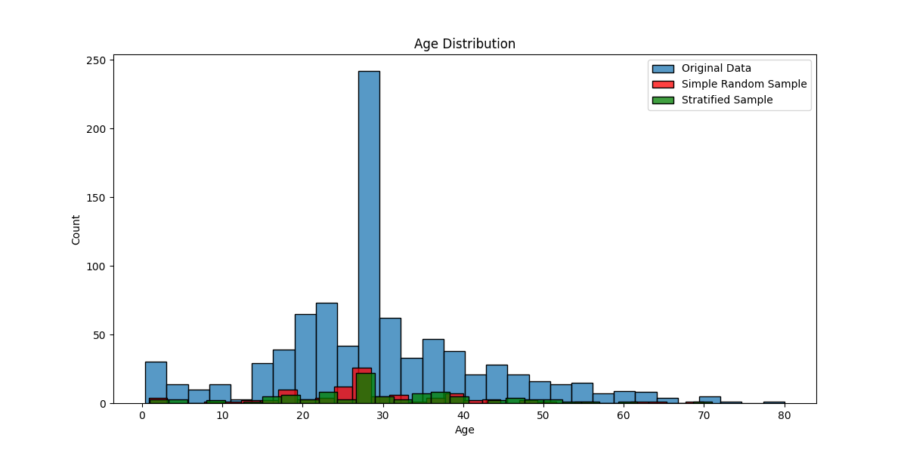

# TP_Echantillonnage

This project demonstrates various sampling techniques using the Titanic dataset. The project includes a Python script (`main.py`) for loading data, handling missing values, and performing simple random sampling and stratified sampling.

## Requirements

- Python 3.x
- pandas
- numpy
- matplotlib
- seaborn
- scikit-learn
## Screenshots

